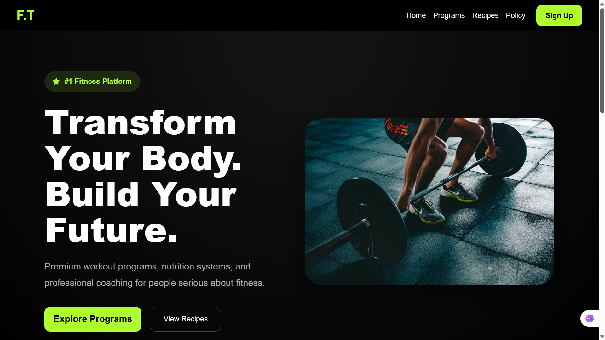
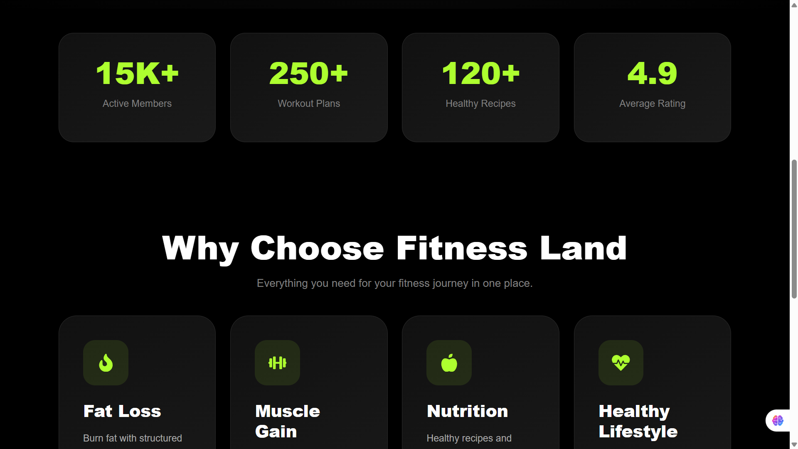
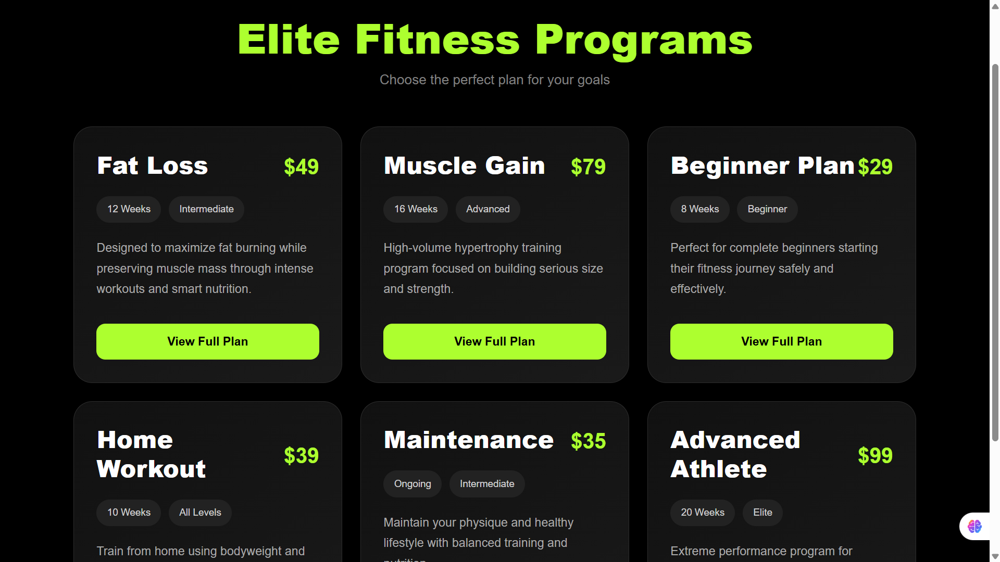
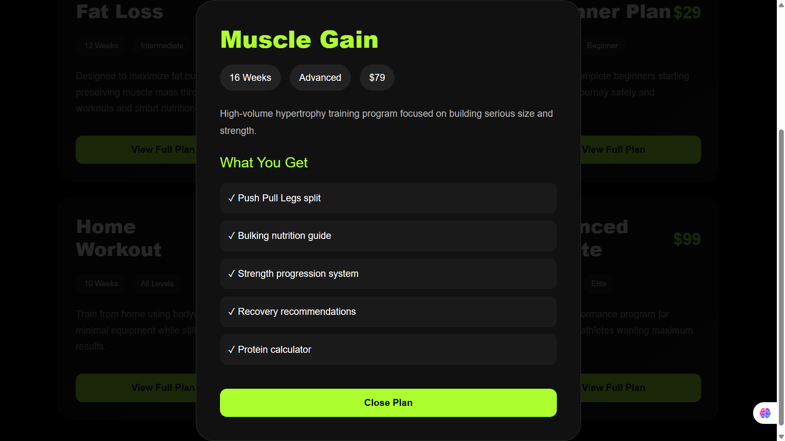
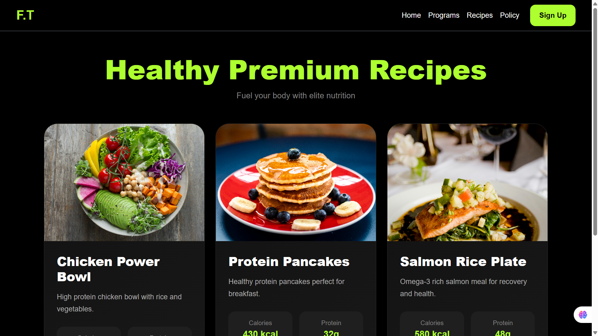
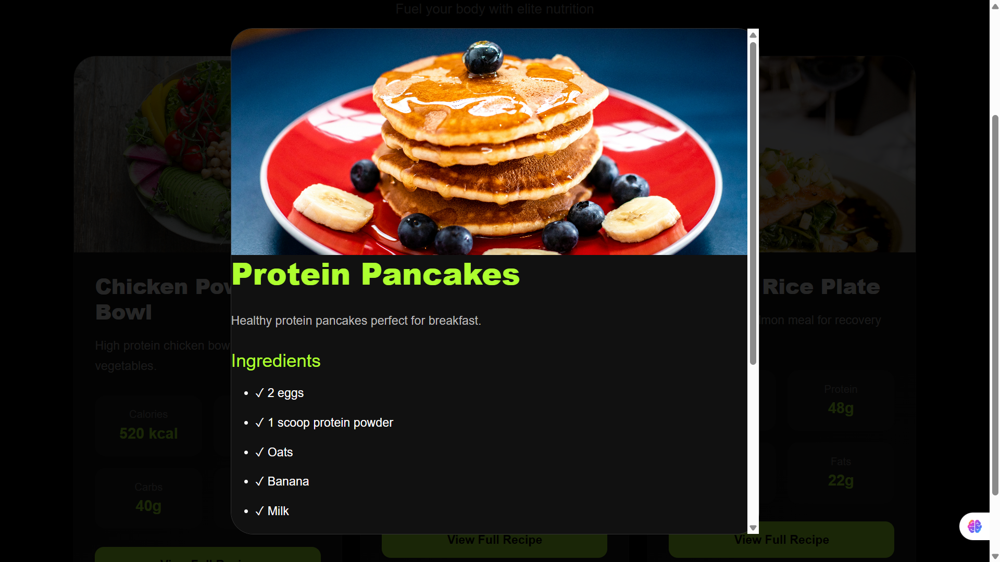
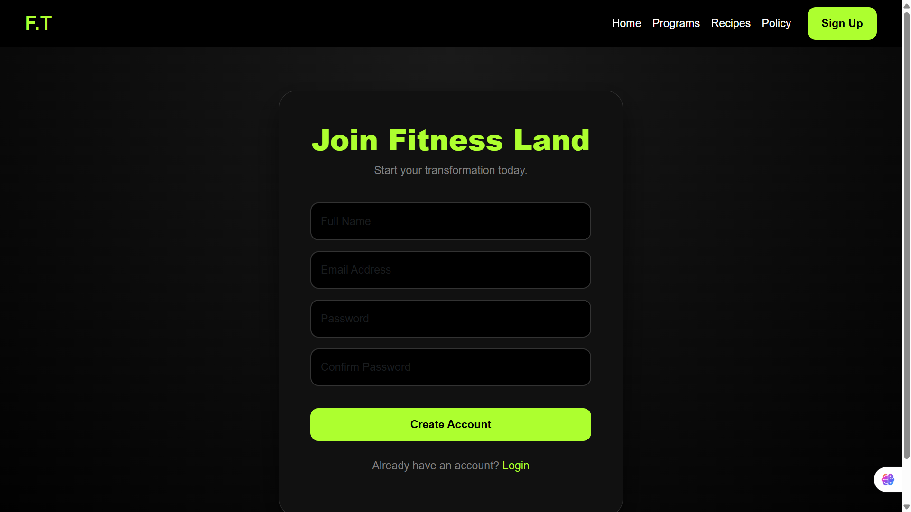
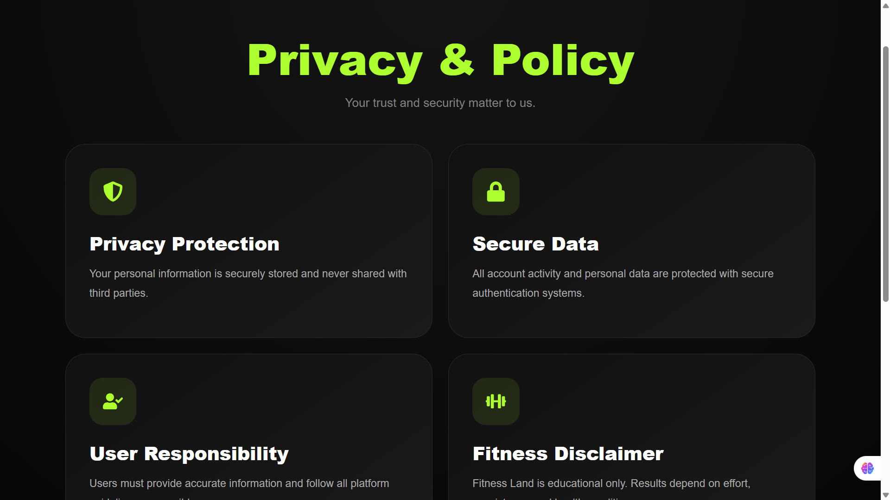
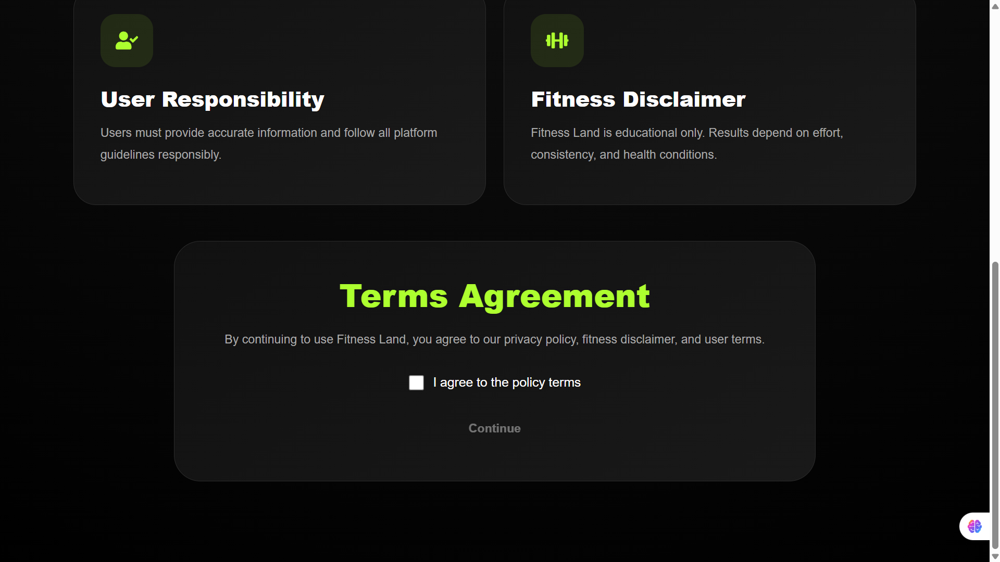

# Fitness Land

## Project Description

Fitness Land is a modern fitness web application developed using React. The website helps users explore workout programs, discover healthy recipes with nutrition information, review privacy policies, and create an account through the signup page.

The project was developed as part of a Web Development course and demonstrates the use of React components, routing, responsive design, and modern UI development.

## Features

* Responsive homepage
* Professional navigation bar
* Fitness programs with detailed workout plans
* Healthy recipes with nutrition facts
* Interactive recipe popups
* Modern signup page
* Privacy policy page
* Mobile-friendly design

## Technologies Used

* React
* React Router DOM
* Bootstrap 5
* CSS3
* JavaScript (ES6)

## Setup Instructions

1. Clone the repository

```bash
git clone YOUR_GITHUB_LINK
```

2. Install dependencies

```bash
npm install
```

3. Run the application

```bash
npm start
```

4. Open

```text
http://localhost:3000
```

## Deployment
Github respitory :
https://github.com/fit-health80/fitness-land
Live Website:
https://fit-health80.github.io/fitness-land


## Screenshots

Insert screenshots of:

* Homepage



* Programs Page


* Recipes Page


* Signup Page

* Policy Page


